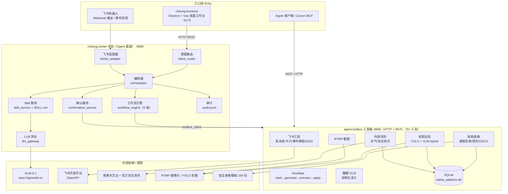
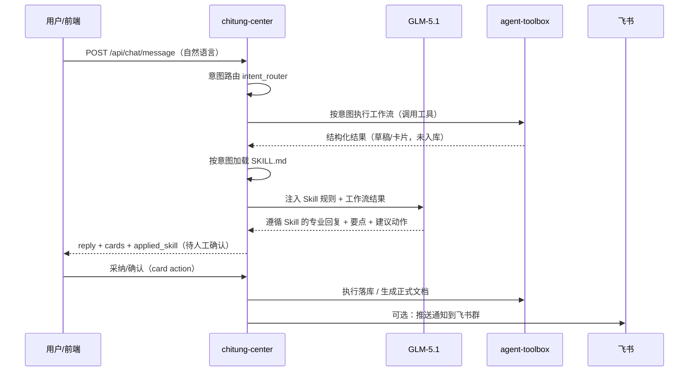

# 赤瞳安全智能平台 — 项目框架图

> 三层架构：**前端桌面工作台 → chitung-center 中台（Agent 基座）→ agent-toolbox 工具箱**。
> 前端只调中台，中台负责意图理解 / Skill 注入 / LLM 网关 / 工作流编排 / 人工确认，
> 一切特权操作（视觉、文档、飞书、OCR…）统一经工具箱执行。

## 1. 总体架构

## 2. 一次"聊天 → 工作流 → Skill 增强 → 确认"的请求流

## 3. 组件与端口

| 组件 | 目录 | 端口 | 角色 |
| --- | --- | --- | --- |
| 桌面前端 | `chitung-frontend` | 5173 | Electron + Vue 工作台 |
| 中台（Agent 基座） | `chitung-center` | 8999 | 意图/编排/Skill/LLM/确认 |
| 工具箱 | `agent-toolbox` | 8899 | HTTP + MCP 工具网关 |
| 数据库 | `agent-toolbox/workspace` | — | SQLite |

## 4. 当前完成度

| 能力 | 状态 |
| --- | --- |
| Agent 中台 + 工具箱 | ✅ 运行 |
| 大模型 GLM-5.1 | ✅ 已接入 |
| 5 条核心工作流 | ✅ 可跑（简报/隐患/填表/检索/巡检）|
| Skill 注入编排 | ✅ 已接入 GLM，可追溯 `applied_skill` |
| 飞书推送（Webhook） | ✅ 已打通 |
| 飞书事件解密（接收） | ✅ 代码就绪，需公网回调地址 |
| 视觉巡检 E2E | ⚠️ 需 YOLO 权重 + 摄像头 |
| 桌面前端 GUI | ✅ 运行 |

> 关系图同时参见仓库根目录 `CODE_RELATIONSHIP_GRAPH.md` 与 `chitung-center/docs/ARCHITECTURE.md`。
